# Agility Hierarchy Relations Reference

Agility features a robust hierarchical navigation framework that enables users to traverse relationships between assets through multiple directions and navigation patterns. This document outlines the hierarchy relationships supported by the Agility APIs, along with their implementation diagram and example yaml payload.


---

## Page 1 of 3
## Scope Hierarchy Relations

### Shared Scope Tree (Node Labels)
- Scope Root: Scope:1000
- Child A: Scope:1100
- Child B: Scope:1200
- Grandchild A1: Scope:1110
- Grandchild B1: Scope:1210
- Parent: Scope:900
- Grandparent: Scope:800

### 1) Children (direct children only)
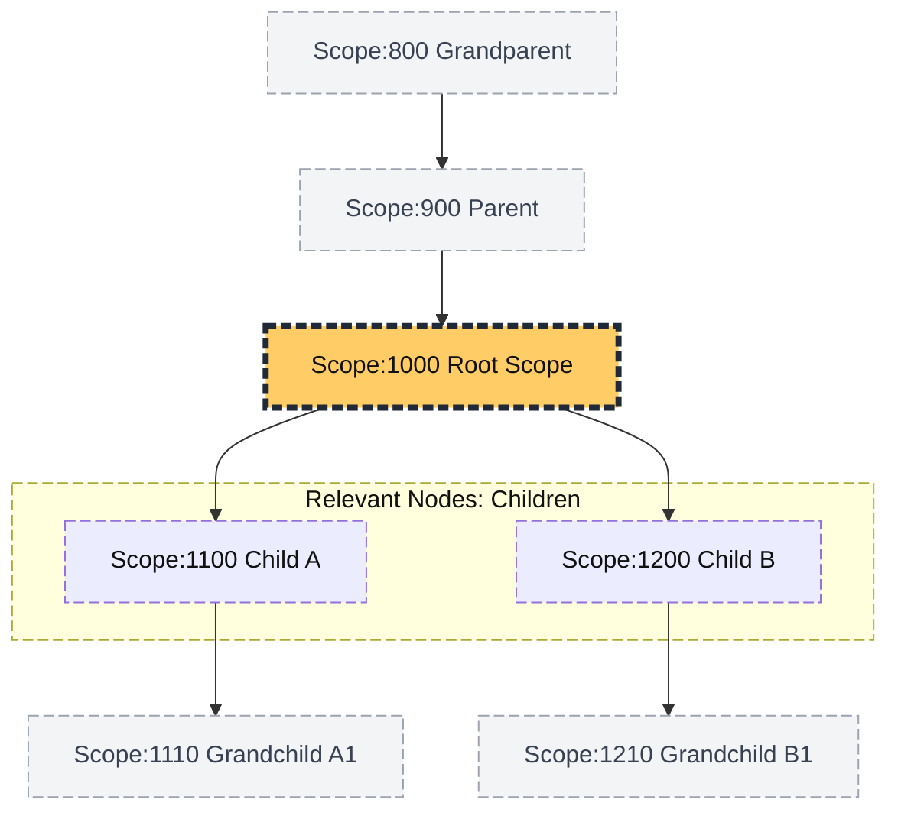
```mermaid
flowchart TD
    GP[Scope:800 Grandparent]
    P[Scope:900 Parent]
    R[Scope:1000 Root Scope]
    A[Scope:1100 Child A]
    B[Scope:1200 Child B]
    A1[Scope:1110 Grandchild A1]
    B1[Scope:1210 Grandchild B1]

    GP --> P --> R
    R --> A
    R --> B
    A --> A1
    B --> B1

    subgraph RESULT[Relevant Nodes: Children]
      A
      B
    end

    classDef root fill:#ffcc66,stroke:#1f2937,stroke-width:4px,stroke-dasharray:7 3,color:#111;
    classDef muted fill:#f3f4f6,stroke:#9ca3af,color:#374151;
    class R root;
    class GP,P,A1,B1 muted;
```

Query.v1
```yaml
from: Scope
where:
  ID: Scope:1000
select:
  - Name
  - from: Children
    select: [ID, Name]
```

### 2) ChildrenAndDown (all descendants, excludes root)
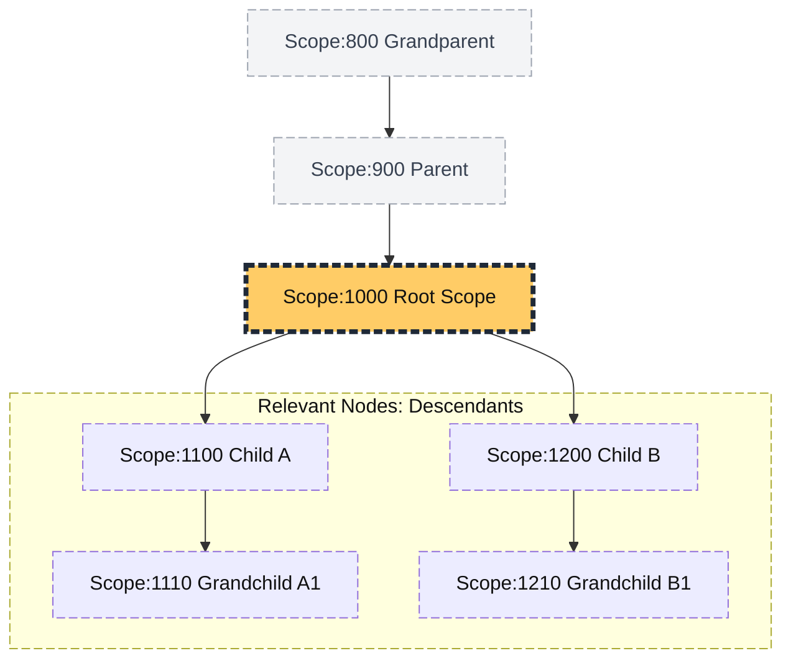
```mermaid
flowchart TD
    GP[Scope:800 Grandparent]
    P[Scope:900 Parent]
    R[Scope:1000 Root Scope]
    A[Scope:1100 Child A]
    B[Scope:1200 Child B]
    A1[Scope:1110 Grandchild A1]
    B1[Scope:1210 Grandchild B1]

    GP --> P --> R
    R --> A
    R --> B
    A --> A1
    B --> B1

    subgraph RESULT[Relevant Nodes: Descendants]
      A
      B
      A1
      B1
    end

    classDef root fill:#ffcc66,stroke:#1f2937,stroke-width:4px,stroke-dasharray:7 3,color:#111;
    classDef muted fill:#f3f4f6,stroke:#9ca3af,color:#374151;
    class R root;
    class GP,P muted;
```

Query.v1
```yaml
from: Scope
where:
  ID: Scope:1000
select:
  - Name
  - from: ChildrenAndDown
    select: [ID, Name]
```

### 3) ChildrenMeAndDown (all descendants, includes root)
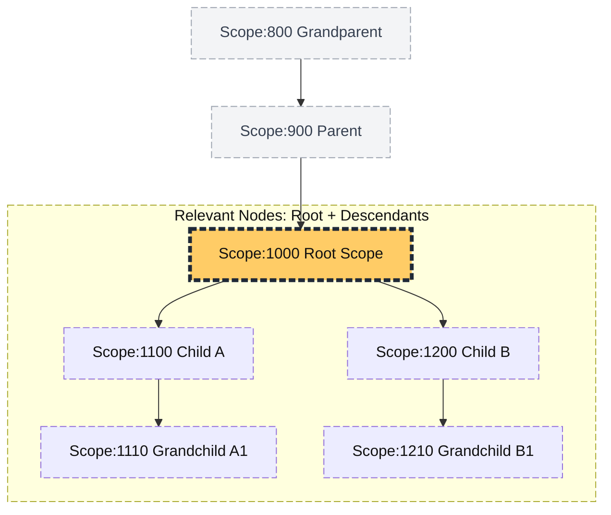
```mermaid
flowchart TD
    GP[Scope:800 Grandparent]
    P[Scope:900 Parent]
    R[Scope:1000 Root Scope]
    A[Scope:1100 Child A]
    B[Scope:1200 Child B]
    A1[Scope:1110 Grandchild A1]
    B1[Scope:1210 Grandchild B1]

    GP --> P --> R
    R --> A
    R --> B
    A --> A1
    B --> B1

    subgraph RESULT[Relevant Nodes: Root + Descendants]
      R
      A
      B
      A1
      B1
    end

    classDef root fill:#ffcc66,stroke:#1f2937,stroke-width:4px,stroke-dasharray:7 3,color:#111;
    classDef muted fill:#f3f4f6,stroke:#9ca3af,color:#374151;
    class R root;
    class GP,P muted;
```

Query.v1
```yaml
from: Scope
where:
  ID: Scope:1000
select:
  - Name
  - from: ChildrenMeAndDown
    select: [ID, Name]
```

### 4) Parent (direct parent only)
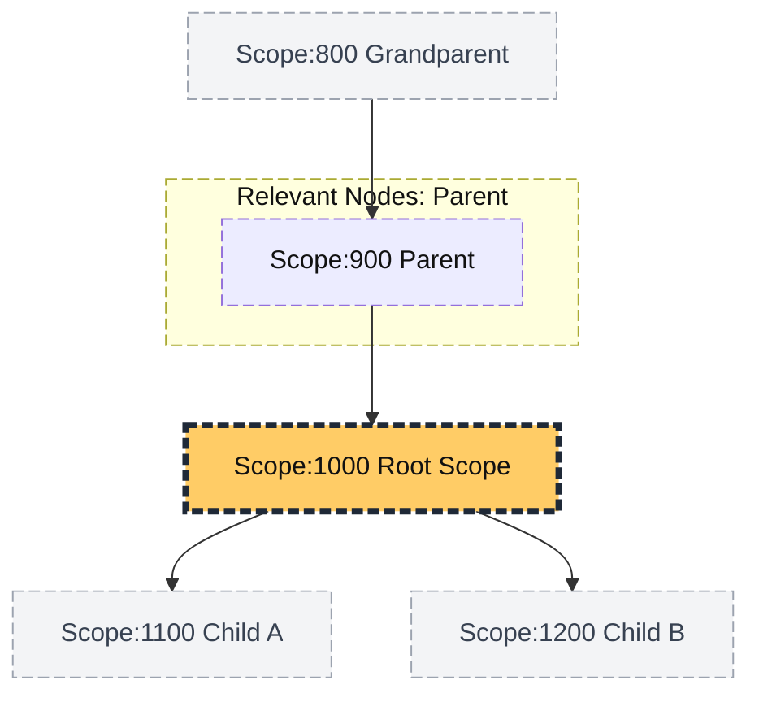
```mermaid
flowchart TD
    GP[Scope:800 Grandparent]
    P[Scope:900 Parent]
    R[Scope:1000 Root Scope]
    A[Scope:1100 Child A]
    B[Scope:1200 Child B]

    GP --> P --> R
    R --> A
    R --> B

    subgraph RESULT[Relevant Nodes: Parent]
      P
    end

    classDef root fill:#ffcc66,stroke:#1f2937,stroke-width:4px,stroke-dasharray:7 3,color:#111;
    classDef muted fill:#f3f4f6,stroke:#9ca3af,color:#374151;
    class R root;
    class GP,A,B muted;
```

Query.v1
```yaml
from: Scope
where:
  ID: Scope:1000
select:
  - Name
  - from: Parent
    select: [ID, Name]
```

### 5) ParentMeAndUp (all ancestors, includes root)
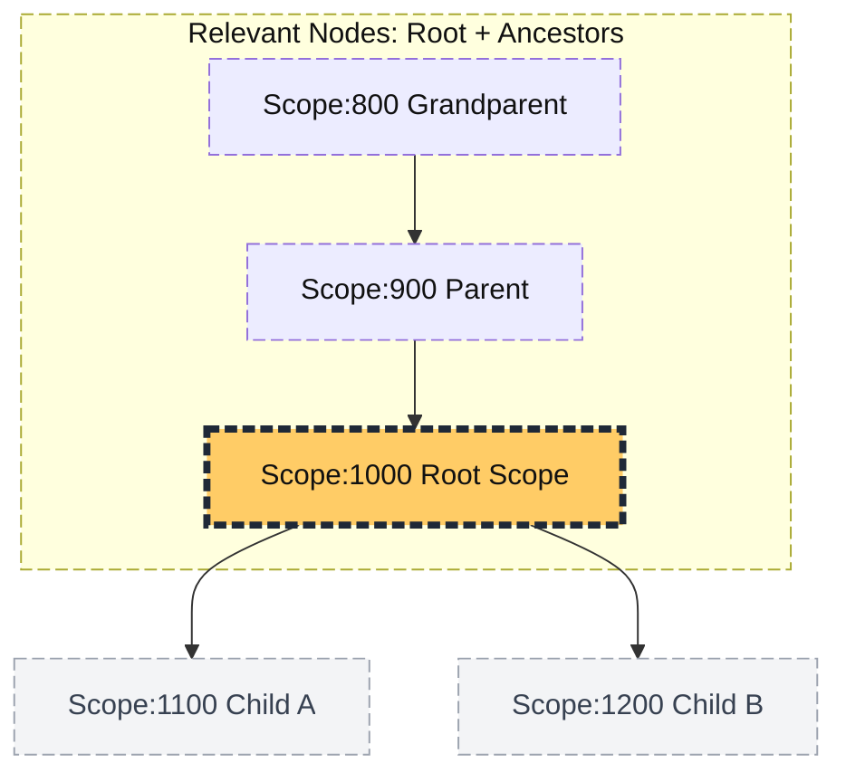
```mermaid
flowchart TD
    GP[Scope:800 Grandparent]
    P[Scope:900 Parent]
    R[Scope:1000 Root Scope]
    A[Scope:1100 Child A]
    B[Scope:1200 Child B]

    GP --> P --> R
    R --> A
    R --> B

    subgraph RESULT[Relevant Nodes: Root + Ancestors]
      GP
      P
      R
    end

    classDef root fill:#ffcc66,stroke:#1f2937,stroke-width:4px,stroke-dasharray:7 3,color:#111;
    classDef muted fill:#f3f4f6,stroke:#9ca3af,color:#374151;
    class R root;
    class A,B muted;
```

Query.v1
```yaml
from: Scope
where:
  ID: Scope:1000
select:
  - Name
  - from: ParentMeAndUp
    select: [ID, Name]
```

### 6) ParentAndUp (all ancestors, excludes root)
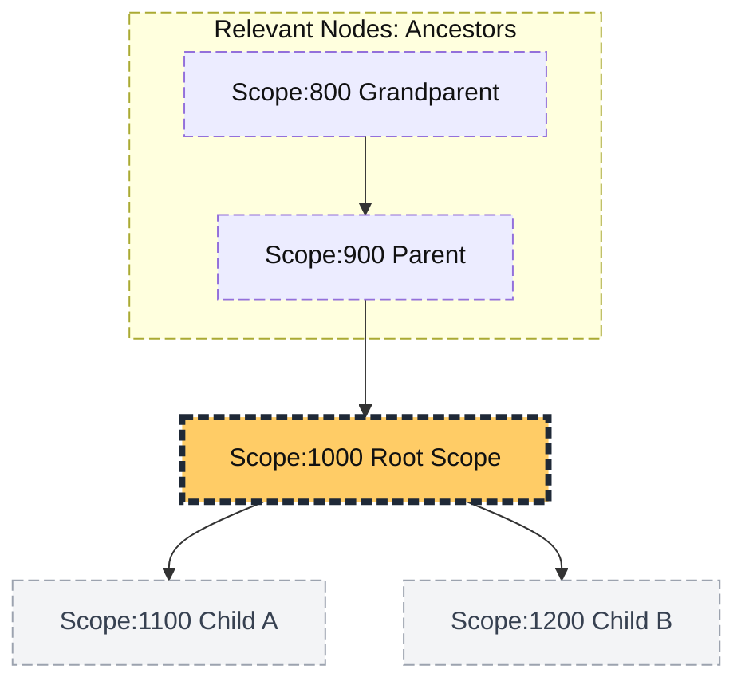
```mermaid
flowchart TD
    GP[Scope:800 Grandparent]
    P[Scope:900 Parent]
    R[Scope:1000 Root Scope]
    A[Scope:1100 Child A]
    B[Scope:1200 Child B]

    GP --> P --> R
    R --> A
    R --> B

    subgraph RESULT[Relevant Nodes: Ancestors]
      GP
      P
    end

    classDef root fill:#ffcc66,stroke:#1f2937,stroke-width:4px,stroke-dasharray:7 3,color:#111;
    classDef muted fill:#f3f4f6,stroke:#9ca3af,color:#374151;
    class R root;
    class A,B muted;
```

Query.v1
```yaml
from: Scope
where:
  ID: Scope:1000
select:
  - Name
  - from: ParentAndUp
    select: [ID, Name]
```

<div style="page-break-after: always;"></div>

## Page 2 of 4
## Workitem Hierarchy Relations

### Shared Workitem Tree (Node Labels)
- Root Workitem: Theme:200
- Story A: Story:210
- Story B: Story:220
- Task A1: Task:211
- Task B1: Task:221
- Parent Epic: Epic:190
- Grandparent Portfolio Epic: Epic:180

### 1) Children (direct children only)
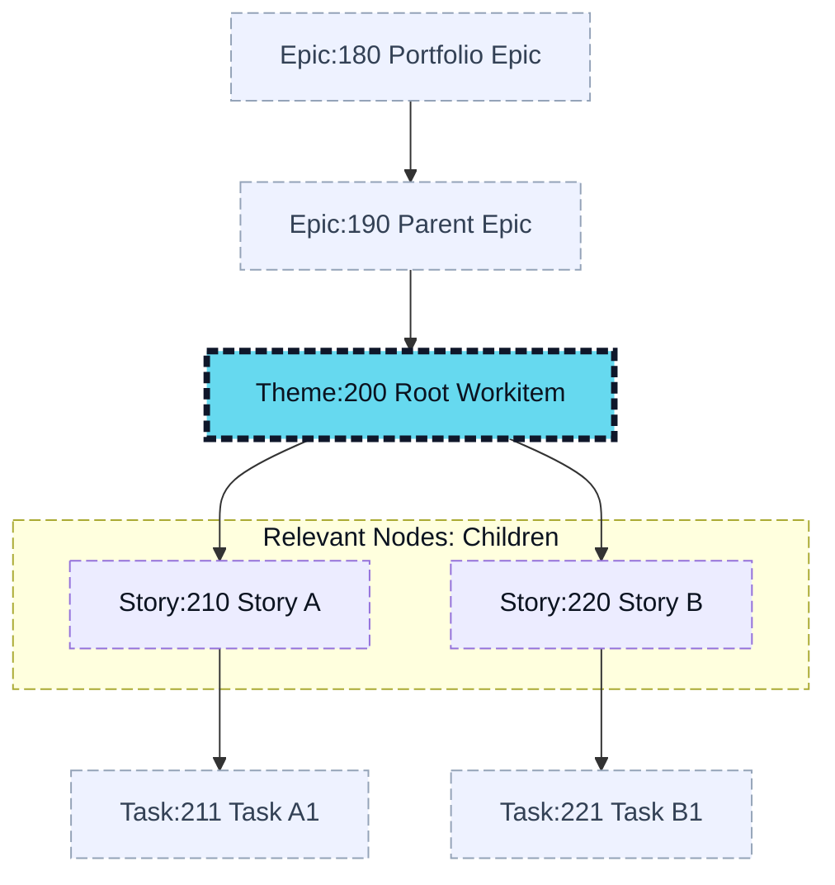
```mermaid
flowchart TD
    GP[Epic:180 Portfolio Epic]
    P[Epic:190 Parent Epic]
    R[Theme:200 Root Workitem]
    A[Story:210 Story A]
    B[Story:220 Story B]
    A1[Task:211 Task A1]
    B1[Task:221 Task B1]

    GP --> P --> R
    R --> A
    R --> B
    A --> A1
    B --> B1

    subgraph RESULT[Relevant Nodes: Children]
      A
      B
    end

    classDef root fill:#66d9ef,stroke:#0f172a,stroke-width:4px,stroke-dasharray:7 3,color:#0b1320;
    classDef muted fill:#eef2ff,stroke:#94a3b8,color:#334155;
    class R root;
    class GP,P,A1,B1 muted;
```

Query.v1
```yaml
from: Theme
where:
  ID: Theme:200
select:
  - Name
  - from: Children
    select: [ID, Name]
```

### 2) ChildrenAndDown (all descendants, excludes root)
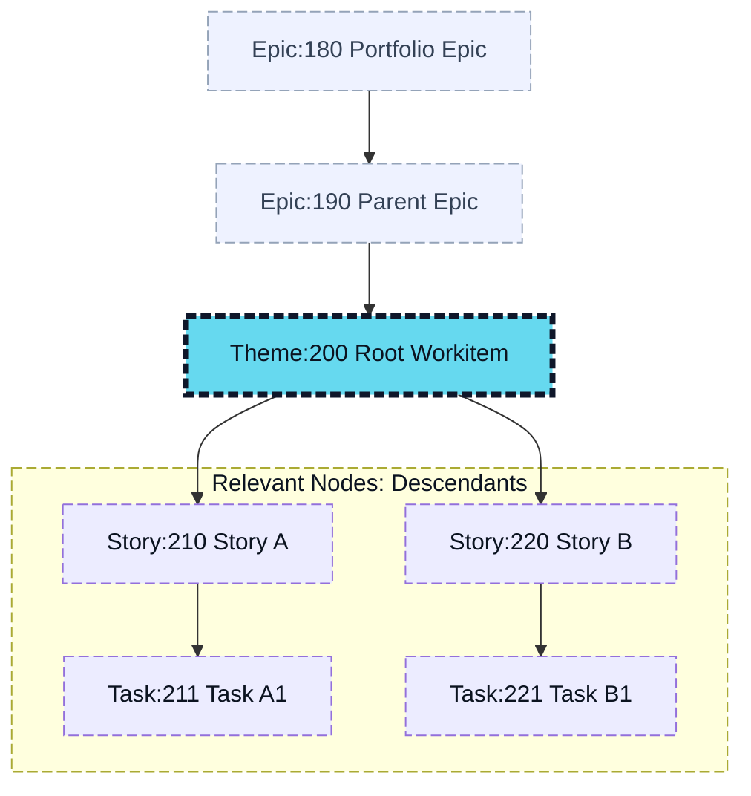
```mermaid
flowchart TD
    GP[Epic:180 Portfolio Epic]
    P[Epic:190 Parent Epic]
    R[Theme:200 Root Workitem]
    A[Story:210 Story A]
    B[Story:220 Story B]
    A1[Task:211 Task A1]
    B1[Task:221 Task B1]

    GP --> P --> R
    R --> A
    R --> B
    A --> A1
    B --> B1

    subgraph RESULT[Relevant Nodes: Descendants]
      A
      B
      A1
      B1
    end

    classDef root fill:#66d9ef,stroke:#0f172a,stroke-width:4px,stroke-dasharray:7 3,color:#0b1320;
    classDef muted fill:#eef2ff,stroke:#94a3b8,color:#334155;
    class R root;
    class GP,P muted;
```

Query.v1
```yaml
from: Theme
where:
  ID: Theme:200
select:
  - Name
  - from: ChildrenAndDown
    select: [ID, Name]
```

### 3) ChildrenMeAndDown (all descendants, includes root)
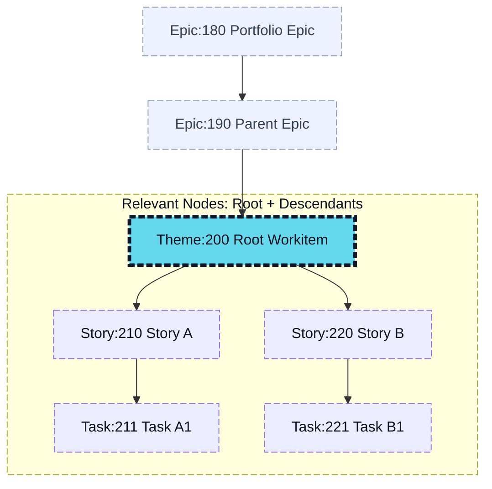
```mermaid
flowchart TD
    GP[Epic:180 Portfolio Epic]
    P[Epic:190 Parent Epic]
    R[Theme:200 Root Workitem]
    A[Story:210 Story A]
    B[Story:220 Story B]
    A1[Task:211 Task A1]
    B1[Task:221 Task B1]

    GP --> P --> R
    R --> A
    R --> B
    A --> A1
    B --> B1

    subgraph RESULT[Relevant Nodes: Root + Descendants]
      R
      A
      B
      A1
      B1
    end

    classDef root fill:#66d9ef,stroke:#0f172a,stroke-width:4px,stroke-dasharray:7 3,color:#0b1320;
    classDef muted fill:#eef2ff,stroke:#94a3b8,color:#334155;
    class R root;
    class GP,P muted;
```

Query.v1
```yaml
from: Theme
where:
  ID: Theme:200
select:
  - Name
  - from: ChildrenMeAndDown
    select: [ID, Name]
```

### 4) Parent (direct parent only)
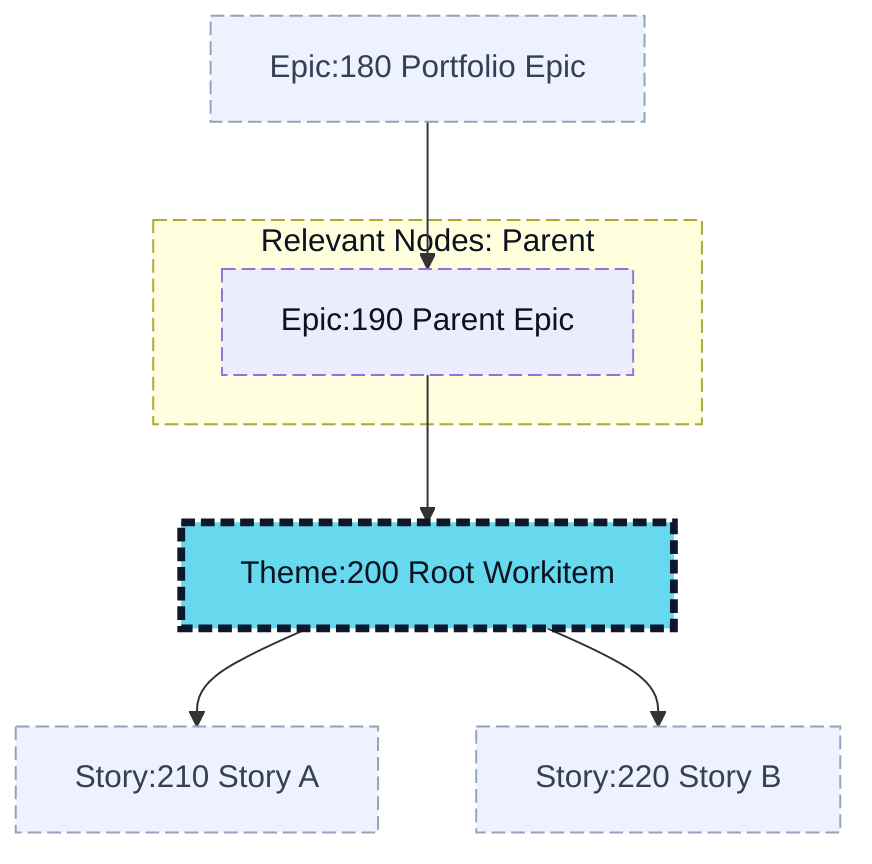
```mermaid
flowchart TD
    GP[Epic:180 Portfolio Epic]
    P[Epic:190 Parent Epic]
    R[Theme:200 Root Workitem]
    A[Story:210 Story A]
    B[Story:220 Story B]

    GP --> P --> R
    R --> A
    R --> B

    subgraph RESULT[Relevant Nodes: Parent]
      P
    end

    classDef root fill:#66d9ef,stroke:#0f172a,stroke-width:4px,stroke-dasharray:7 3,color:#0b1320;
    classDef muted fill:#eef2ff,stroke:#94a3b8,color:#334155;
    class R root;
    class GP,A,B muted;
```

Query.v1
```yaml
from: Theme
where:
  ID: Theme:200
select:
  - Name
  - from: Parent
    select: [ID, Name]
```

### 5) ParentMeAndUp (all ancestors, includes root)
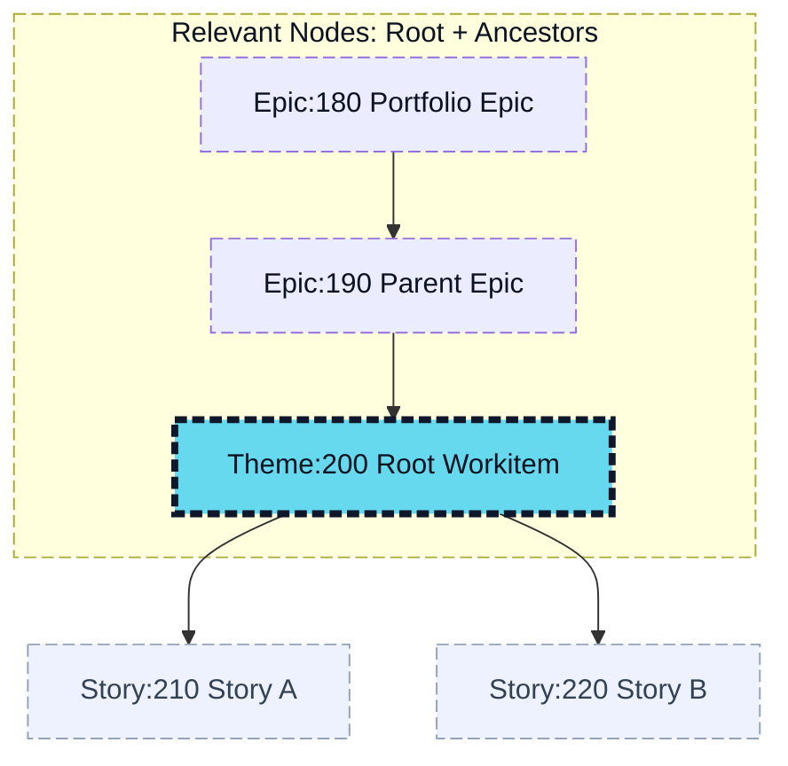
```mermaid
flowchart TD
    GP[Epic:180 Portfolio Epic]
    P[Epic:190 Parent Epic]
    R[Theme:200 Root Workitem]
    A[Story:210 Story A]
    B[Story:220 Story B]

    GP --> P --> R
    R --> A
    R --> B

    subgraph RESULT[Relevant Nodes: Root + Ancestors]
      GP
      P
      R
    end

    classDef root fill:#66d9ef,stroke:#0f172a,stroke-width:4px,stroke-dasharray:7 3,color:#0b1320;
    classDef muted fill:#eef2ff,stroke:#94a3b8,color:#334155;
    class R root;
    class A,B muted;
```

Query.v1
```yaml
from: Theme
where:
  ID: Theme:200
select:
  - Name
  - from: ParentMeAndUp
    select: [ID, Name]
```

### 6) ParentAndUp (all ancestors, excludes root)
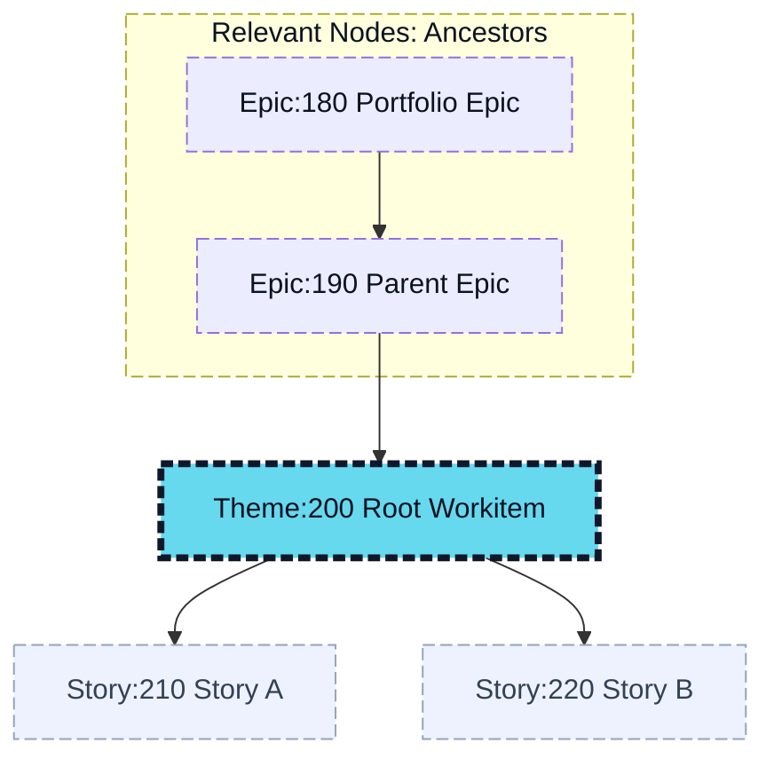
```mermaid
flowchart TD
    GP[Epic:180 Portfolio Epic]
    P[Epic:190 Parent Epic]
    R[Theme:200 Root Workitem]
    A[Story:210 Story A]
    B[Story:220 Story B]

    GP --> P --> R
    R --> A
    R --> B

    subgraph RESULT[Relevant Nodes: Ancestors]
      GP
      P
    end

    classDef root fill:#66d9ef,stroke:#0f172a,stroke-width:4px,stroke-dasharray:7 3,color:#0b1320;
    classDef muted fill:#eef2ff,stroke:#94a3b8,color:#334155;
    class R root;
    class A,B muted;
```

Query.v1
```yaml
from: Theme
where:
  ID: Theme:200
select:
  - Name
  - from: ParentAndUp
    select: [ID, Name]
```

<div style="page-break-after: always;"></div>

## Page 3 of 4
## Epic Hierarchy Relations

### Shared Epic Tree (Node Labels)
- Root Epic: Epic:300
- Sub Epic A: Epic:310
- Sub Epic B: Epic:320
- Sub Epic A1: Epic:311
- Sub Epic B1: Epic:321
- Super Epic: Epic:290
- Portfolio Super Epic: Epic:280

### 1) Subs (direct sub-epics only)
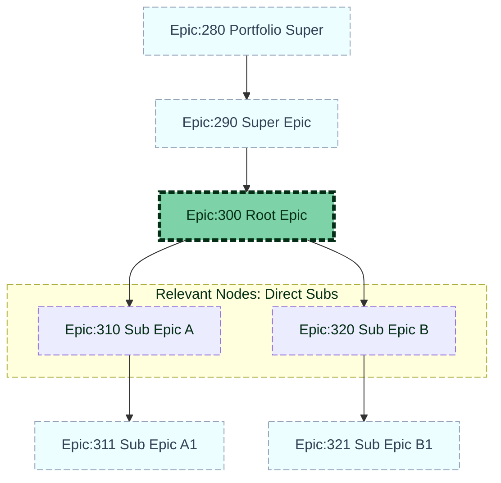
```mermaid
flowchart TD
    GP[Epic:280 Portfolio Super]
    P[Epic:290 Super Epic]
    R[Epic:300 Root Epic]
    A[Epic:310 Sub Epic A]
    B[Epic:320 Sub Epic B]
    A1[Epic:311 Sub Epic A1]
    B1[Epic:321 Sub Epic B1]

    GP --> P --> R
    R --> A
    R --> B
    A --> A1
    B --> B1

    subgraph RESULT[Relevant Nodes: Direct Subs]
      A
      B
    end

    classDef root fill:#7dd3a7,stroke:#052e16,stroke-width:4px,stroke-dasharray:7 3,color:#052e16;
    classDef muted fill:#ecfeff,stroke:#94a3b8,color:#334155;
    class R root;
    class GP,P,A1,B1 muted;
```

Query.v1
```yaml
from: Epic
where:
  ID: Epic:300
select:
  - Name
  - from: Subs
    select: [ID, Name]
```

### 2) SubsAndDown (all descendants, excludes root)
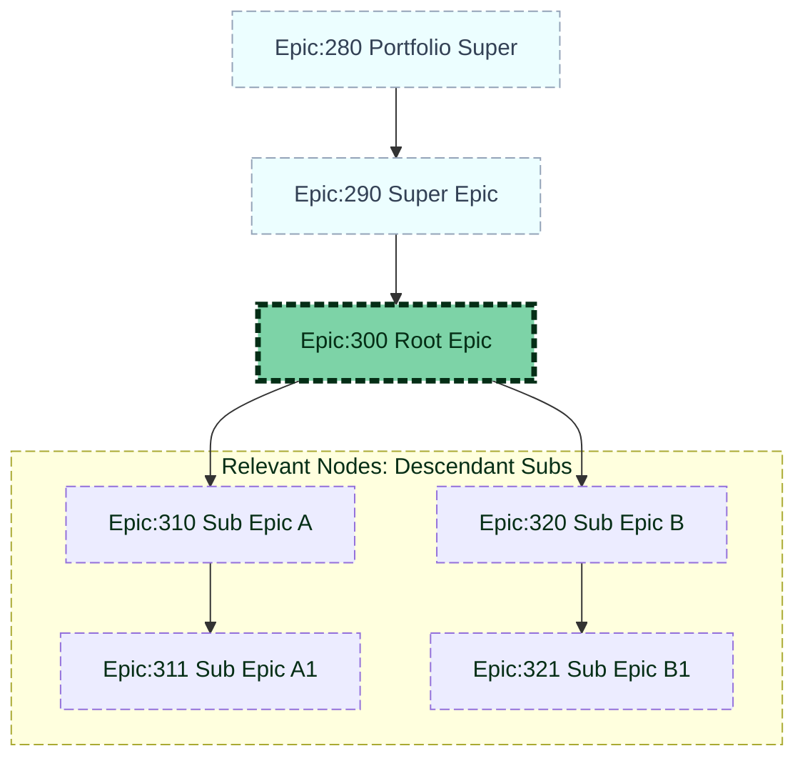
```mermaid
flowchart TD
    GP[Epic:280 Portfolio Super]
    P[Epic:290 Super Epic]
    R[Epic:300 Root Epic]
    A[Epic:310 Sub Epic A]
    B[Epic:320 Sub Epic B]
    A1[Epic:311 Sub Epic A1]
    B1[Epic:321 Sub Epic B1]

    GP --> P --> R
    R --> A
    R --> B
    A --> A1
    B --> B1

    subgraph RESULT[Relevant Nodes: Descendant Subs]
      A
      B
      A1
      B1
    end

    classDef root fill:#7dd3a7,stroke:#052e16,stroke-width:4px,stroke-dasharray:7 3,color:#052e16;
    classDef muted fill:#ecfeff,stroke:#94a3b8,color:#334155;
    class R root;
    class GP,P muted;
```

Query.v1
```yaml
from: Epic
where:
  ID: Epic:300
select:
  - Name
  - from: SubsAndDown
    select: [ID, Name]
```

### 3) SubsMeAndDown (all descendants, includes root)
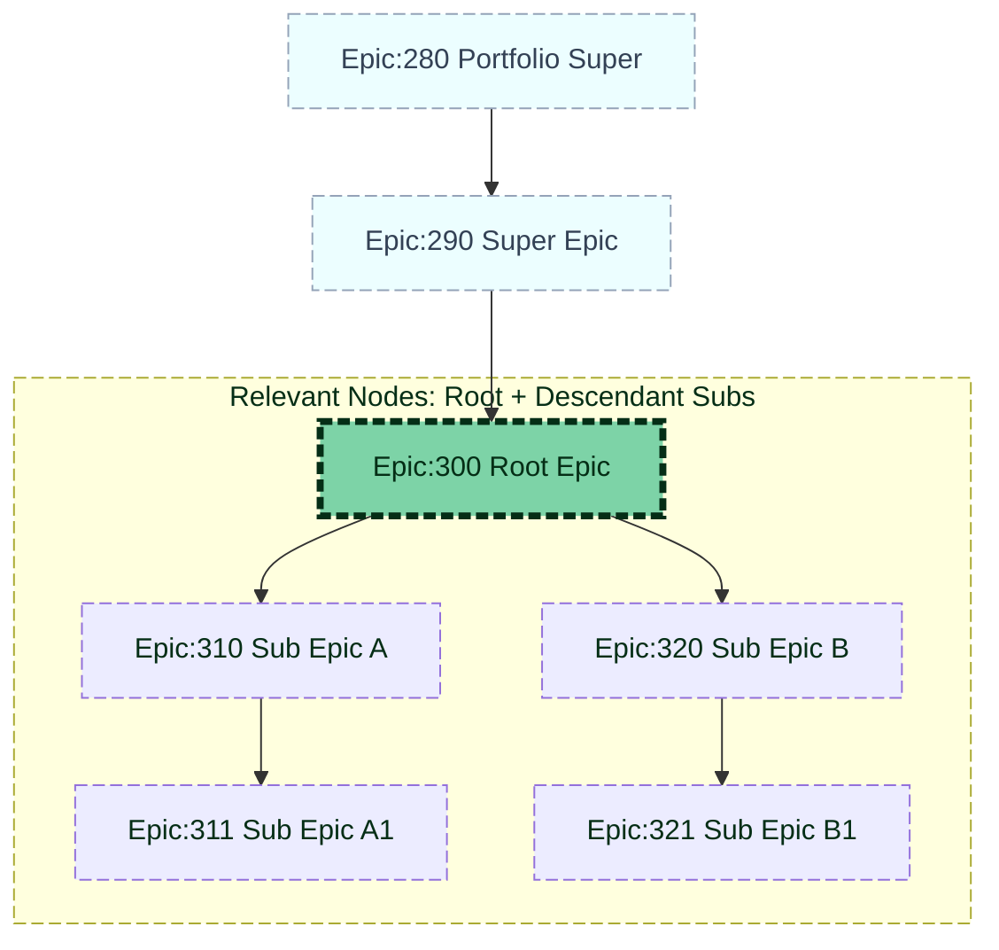
```mermaid
flowchart TD
    GP[Epic:280 Portfolio Super]
    P[Epic:290 Super Epic]
    R[Epic:300 Root Epic]
    A[Epic:310 Sub Epic A]
    B[Epic:320 Sub Epic B]
    A1[Epic:311 Sub Epic A1]
    B1[Epic:321 Sub Epic B1]

    GP --> P --> R
    R --> A
    R --> B
    A --> A1
    B --> B1

    subgraph RESULT[Relevant Nodes: Root + Descendant Subs]
      R
      A
      B
      A1
      B1
    end

    classDef root fill:#7dd3a7,stroke:#052e16,stroke-width:4px,stroke-dasharray:7 3,color:#052e16;
    classDef muted fill:#ecfeff,stroke:#94a3b8,color:#334155;
    class R root;
    class GP,P muted;
```

Query.v1
```yaml
from: Epic
where:
  ID: Epic:300
select:
  - Name
  - from: SubsMeAndDown
    select: [ID, Name]
```

### 4) Super (direct parent epic only)
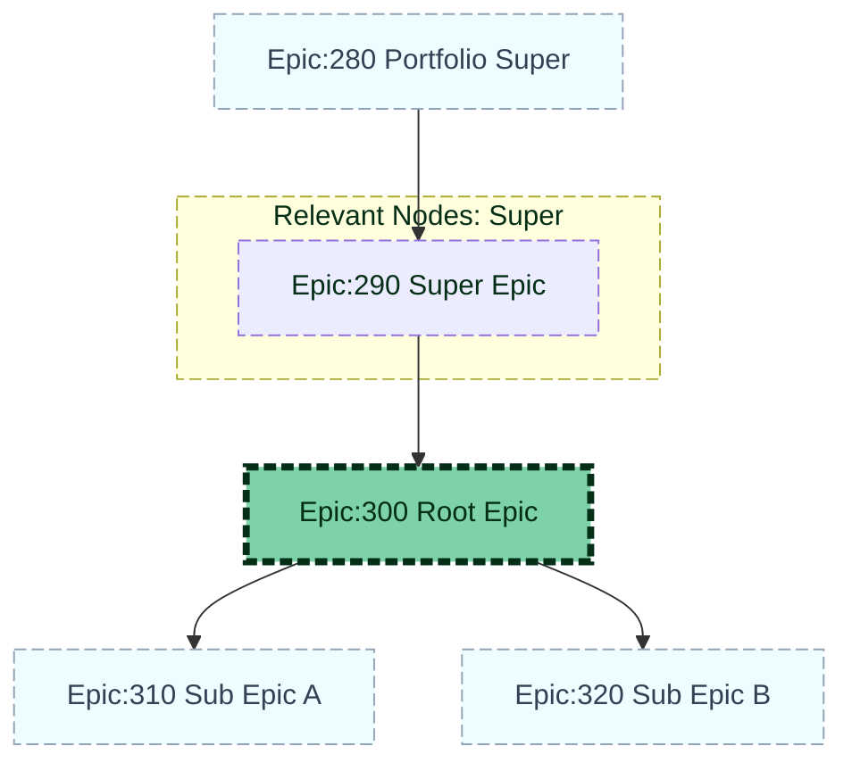
```mermaid
flowchart TD
    GP[Epic:280 Portfolio Super]
    P[Epic:290 Super Epic]
    R[Epic:300 Root Epic]
    A[Epic:310 Sub Epic A]
    B[Epic:320 Sub Epic B]

    GP --> P --> R
    R --> A
    R --> B

    subgraph RESULT[Relevant Nodes: Super]
      P
    end

    classDef root fill:#7dd3a7,stroke:#052e16,stroke-width:4px,stroke-dasharray:7 3,color:#052e16;
    classDef muted fill:#ecfeff,stroke:#94a3b8,color:#334155;
    class R root;
    class GP,A,B muted;
```

Query.v1
```yaml
from: Epic
where:
  ID: Epic:300
select:
  - Name
  - from: Super
    select: [ID, Name]
```

### 5) SuperMeAndUp (all ancestors, includes root)
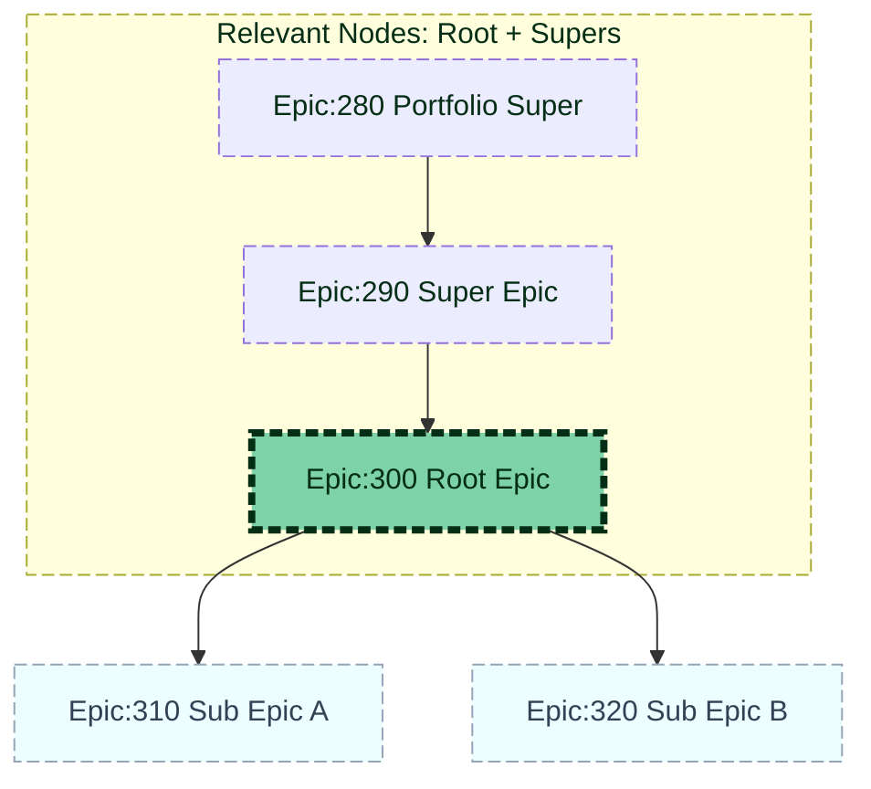
```mermaid
flowchart TD
    GP[Epic:280 Portfolio Super]
    P[Epic:290 Super Epic]
    R[Epic:300 Root Epic]
    A[Epic:310 Sub Epic A]
    B[Epic:320 Sub Epic B]

    GP --> P --> R
    R --> A
    R --> B

    subgraph RESULT[Relevant Nodes: Root + Supers]
      GP
      P
      R
    end

    classDef root fill:#7dd3a7,stroke:#052e16,stroke-width:4px,stroke-dasharray:7 3,color:#052e16;
    classDef muted fill:#ecfeff,stroke:#94a3b8,color:#334155;
    class R root;
    class A,B muted;
```

Query.v1
```yaml
from: Epic
where:
  ID: Epic:300
select:
  - Name
  - from: SuperMeAndUp
    select: [ID, Name]
```

### 6) SuperAndUp (all ancestors, excludes root)
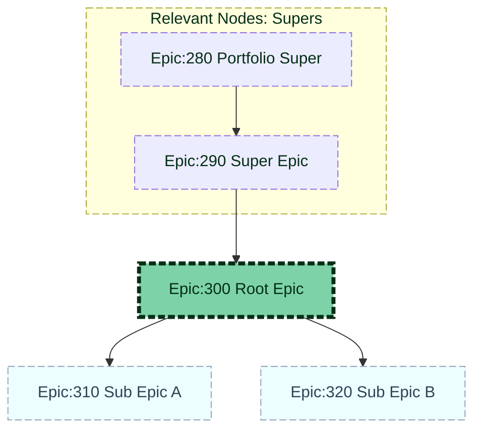
```mermaid
flowchart TD
    GP[Epic:280 Portfolio Super]
    P[Epic:290 Super Epic]
    R[Epic:300 Root Epic]
    A[Epic:310 Sub Epic A]
    B[Epic:320 Sub Epic B]

    GP --> P --> R
    R --> A
    R --> B

    subgraph RESULT[Relevant Nodes: Supers]
      GP
      P
    end

    classDef root fill:#7dd3a7,stroke:#052e16,stroke-width:4px,stroke-dasharray:7 3,color:#052e16;
    classDef muted fill:#ecfeff,stroke:#94a3b8,color:#334155;
    class R root;
    class A,B muted;
```

Query.v1
```yaml
from: Epic
where:
  ID: Epic:300
select:
  - Name
  - from: SuperAndUp
    select: [ID, Name]
```


